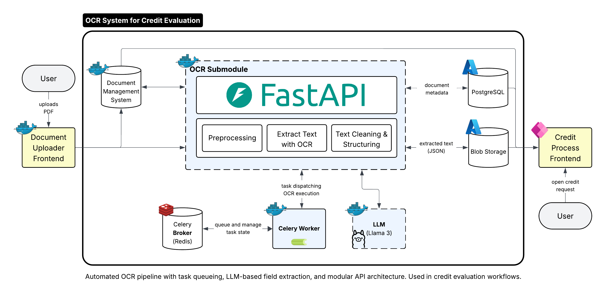

# OCR System for Credit Evaluation

*Transform manual credit document processing into intelligent, automated workflows using local AI and microservices architecture.*

This project is a comprehensive tutorial that guides you through building a scalable OCR system for credit request document processing. You'll learn how to extract, analyze, and validate financial data from PDFs and scanned documents using local AI models and microservices architecture. The tutorial covers everything from infrastructure setup to advanced spatial analysis techniques, providing you with the skills to build production-ready document processing systems.



---

## What This System Does

The Credit OCR System automates the processing of credit-related documents:

- **Extracts** key financial data from PDFs and scanned documents using OCR
- **Analyzes** information using local AI models (no external APIs)
- **Validates** data across multiple document types with business rules
- **Visualizes** processing results with bounding box overlays for quality assurance
- **Stores** results in organized, stage-based storage for easy retrieval
- **Orchestrates** complete document processing workflows with error handling

### Document Processing Pipeline

1. **Document Upload** → Documents are uploaded to DMS with metadata and blob storage
2. **OCR Processing** → EasyOCR extracts text with spatial analysis and bounding boxes
3. **LLM Field Extraction** → Local AI models extract and validate structured business data
4. **Visualization Generation** → OCR results are visualized with bounding box overlays
5. **Stage-Based Storage** → Results are organized by processing stage (raw, OCR, LLM, annotated)
6. **Data Validation** → Business rules validate extracted information with confidence scores
7. **Integrated Pipeline** → Complete workflow orchestration with error handling and logging
8. **Status Tracking** → Real-time status updates track document readiness and processing stages
9. **Async Processing** → Background processing with Celery workers for scalable, non-blocking operations
10. **User Review** → Credit officers can review extracted information, confidence scores, and document overlays

### Real-World Impact

**Before:** Loan officers manually review 15-20 page applications, taking hours per case  
**After:** Automated processing extracts and analyzes key data in under 10 minutes, with human oversight for accuracy

## System Architecture

### Core Services

| Service      | Purpose                                   | Technology            |
|--------------|-------------------------------------------|-----------------------|
| **PostgreSQL** | Document metadata & extracted data storage | Relational database   |
| **Redis**      | Message broker for background job processing | In-memory data store  |
| **Ollama**     | Local LLM model hosting (Llama3.1:8b)        | LLM inference server  |
| **Azurite**    | Document file storage (Azure Blob emulator) | Object storage        |
| **Celery**     | Async task processing and worker management | Task queue system     |

### Key Design Principles

- **Local-First**: All processing happens on your infrastructure
- **Privacy-Focused**: No external AI APIs or data sharing
- **Microservices**: Each service scales independently
- **Production-Ready**: Docker Compose orchestration with health checks

---

## Quick Start

**Ready to build? Start here:**

1. **Setup Infrastructure** → [`notebooks/1-setup/`](./notebooks/1-setup/)
   - **Executable Guide**: [`01_setup.ipynb`](./notebooks/1-setup/01_setup.ipynb) - Step-by-step setup
   - **Deep Dive**: [`README.md`](./notebooks/1-setup/README.md) - Architecture & learning resources

2. **OCR Text Extraction** → [`notebooks/2-ocr-based-text-extraction/`](./notebooks/2-ocr-based-text-extraction/)
   - **Executable Guide**: [`02_ocr_text_extraction.ipynb`](./notebooks/2-ocr-based-text-extraction/02_ocr_text_extraction.ipynb) - EasyOCR implementation with spatial analysis
   - **Deep Dive**: [`README.md`](./notebooks/2-ocr-based-text-extraction/README.md) - OCR theory, spatial reconstruction, and production considerations

3. **LLM Field Extraction** → [`notebooks/3-llm-field-extraction/`](./notebooks/3-llm-field-extraction/)
   - **Executable Guide**: [`03_llm_field_extraction.ipynb`](./notebooks/3-llm-field-extraction/03_llm_field_extraction.ipynb) - Local LLM processing with llama3.1:8b model
   - **Deep Dive**: [`README.md`](./notebooks/3-llm-field-extraction/README.md) - LLM integration, prompt engineering, and field validation

4. **Function Integration** → [`notebooks/4-function-integration/`](./notebooks/4-function-integration/)
   - **Executable Guide**: [`04_integration.ipynb`](./notebooks/4-function-integration/04_integration.ipynb) - Complete integrated pipeline combining OCR and LLM processing
   - **Deep Dive**: [`README.md`](./notebooks/4-function-integration/README.md) - Integration architecture, scalability considerations, and production patterns

5. **DMS Upload (Mock)** → [`notebooks/5-dms-upload/`](./notebooks/5-dms-upload/)
   - **Executable Guide**: [`05_dms_upload.ipynb`](./notebooks/5-dms-upload/05_dms_upload.ipynb) - Document management system implementation
   - **Deep Dive**: [`README.md`](./notebooks/5-dms-upload/README.md) - DMS patterns, adapter design, and integration guidance

6. **Document Processing Status** → [`notebooks/6-document-processing-status/`](./notebooks/6-document-processing-status/)
   - **Executable Guide**: [`06_document_processing_status.ipynb`](./notebooks/6-document-processing-status/06_document_processing_status.ipynb) - Status models and extraction job tracking
   - **Deep Dive**: [`README.md`](./notebooks/6-document-processing-status/README.md) - Status model theory, benefits, tradeoffs, and best practices

7. **Async Processing** → [`notebooks/7-async-processing/`](./notebooks/7-async-processing/)
   - **Executable Guide**: [`07_async_processing.ipynb`](./notebooks/7-async-processing/07_async_processing.ipynb) - Celery-based async document processing
   - **Deep Dive**: [`README.md`](./notebooks/7-async-processing/README.md) - Async processing theory, scaling patterns, and production considerations

8. **API Service** → [`notebooks/8-api-service/`](./notebooks/8-api-service/)
   - **Executable Guide**: [`08_api_service.ipynb`](./notebooks/8-api-service/08_api_service.ipynb) - FastAPI web service with real-time processing interface
   - **Deep Dive**: [`README.md`](./notebooks/8-api-service/README.md) - API design, web interface architecture, and service integration

9. **Application Setup** → [`notebooks/9-application-setup/`](./notebooks/9-application-setup/)
   - **Executable Guide**: [`setup.ipynb`](./notebooks/9-application-setup/setup.ipynb) - One-command system startup and verification
   - **Deep Dive**: [`README.md`](./notebooks/9-application-setup/README.md) - Complete application setup, troubleshooting, and architecture overview

## Development Workflow

### Initial Setup
```bash
# Clone and setup
git clone https://github.com/markuskuehnle/credit-ocr-system
cd credit-ocr-system

# Create environment and install dependencies
uv venv && uv sync

# Start services
docker compose up -d

# Launch development environment
uv run jupyter notebook
```

### Daily Development
```bash
# Check service status
docker compose ps

# View logs
docker compose logs [service-name]

# Restart if needed
docker compose restart [service-name]
```

## Prerequisites

### Required Software
- **Python 3.10+** - Runtime environment
- **Docker Desktop** - Container orchestration
- **UV Package Manager** - Dependency management
- **Git** - Version control (optional)

### System Requirements
- **Minimum**: 8GB RAM, 15GB disk space
- **Recommended**: 16GB RAM, 25GB disk space
- **CPU**: Multi-core processor (Intel/AMD x64 or Apple Silicon)

## Beyond Credit Processing

This system demonstrates architectural patterns used in:

- **RAG Systems** - Document preprocessing → Vector databases → AI generation
- **AI Agent Architectures** - Microservices → Multi-agent communication
- **Enterprise Document Intelligence** - Legal, medical, research document processing
- **Compliance Systems** - Automated document analysis and validation

The patterns you'll learn here are foundational for building any modern document-based AI system.

## Project Structure

```
credit-ocr-system/
├── README.md                             # This file - project overview
├── compose.yml                           # Docker services orchestration
├── pyproject.toml                        # Python dependencies
├── config/                               # Configuration files
├── notebooks/                            # Learning & development notebooks
│   ├── 1-setup/                          # Infrastructure setup tutorial
│   │   ├── README.md                     # Architecture deep dive
│   │   └── 01_setup.ipynb                # Executable setup guide
│   ├── 2-ocr-based-text-extraction/      # OCR text extraction tutorial
│   │   ├── README.md                     # OCR theory & spatial analysis guide
│   │   └── 02_ocr_text_extraction.ipynb  # EasyOCR implementation
│   ├── 3-llm-field-extraction/           # LLM field extraction tutorial
│   │   ├── README.md                     # LLM integration & prompt engineering guide
│   │   └── 03_llm_field_extraction.ipynb # Local LLM processing implementation
│   ├── 4-function-integration/           # Function integration & production pipeline
│   │   ├── README.md                     # Integration architecture & scalability guide
│   │   └── 04_integration.ipynb          # Complete integrated pipeline implementation
│   ├── 5-dms-upload/                     # DMS integration & document management
│   │   ├── README.md                     # DMS patterns & adapter design guide
│   │   └── 05_dms_upload.ipynb           # Document management system implementation
│   ├── 6-document-processing-status/     # Status models & extraction jobs
│   │   ├── README.md                     # Status model theory & best practices
│   │   └── 06_document_processing_status.ipynb # Status tracking implementation
│   ├── 7-async-processing/               # Async processing with Celery
│   │   ├── README.md                     # Async processing theory & scaling patterns
│   │   └── 07_async_processing.ipynb     # Celery-based async processing implementation
│   ├── 8-api-service/                    # FastAPI web service & interface
│   │   ├── README.md                     # API design & web interface architecture
│   │   └── 08_api_service.ipynb          # Web service implementation
│   └── application-setup/                # Complete application setup & troubleshooting
│       ├── README.md                     # Setup guide & architecture overview
│       └── setup.ipynb                   # One-command startup & verification
├── src/                                  # Application source code
│   ├── __init__.py                       # Package initialization
│   ├── config/                           # Configuration management
│   │   ├── __init__.py                   # Package initialization
│   │   └── system.py                     # System configuration
│   ├── celery_app.py                     # Celery application configuration
│   ├── async_processing.py               # Async document processing service
│   ├── dms/                              # Document Management System modules
│   │   ├── __init__.py                   # Package initialization
│   │   ├── environment.py                # DMS mock environment setup
│   │   ├── service.py                    # DMS service layer
│   │   ├── interfaces.py                 # Storage and metadata interfaces
│   │   └── adapters.py                   # Concrete implementations
│   ├── integration/                      # Pipeline integration modules
│   │   ├── __init__.py                   # Package initialization
│   │   ├── orchestration.py              # Workflow orchestration
│   │   └── pipeline.py                   # Processing pipeline
│   ├── llm/                              # Large Language Model modules
│   │   ├── __init__.py                   # Package initialization
│   │   ├── client.py                     # LLM client abstraction
│   │   ├── config.py                     # LLM configuration
│   │   ├── field_extractor.py            # Field extraction logic
│   │   └── validation.py                 # Data validation
│   ├── ocr/                              # OCR processing modules
│   │   ├── __init__.py                   # Package initialization
│   │   ├── easyocr_client.py             # EasyOCR client wrapper
│   │   ├── label_value_extraction.py     # Label-value pair extraction
│   │   ├── postprocess.py                # OCR post-processing
│   │   └── spatial_analysis.py           # Spatial document analysis
│   ├── storage/                          # Storage abstraction modules
│   │   ├── __init__.py                   # Package initialization
│   │   ├── blob_operations.py            # Blob storage operations
│   │   └── storage.py                    # Storage abstraction layer
│   ├── tasks/                            # Celery task modules
│   │   ├── __init__.py                   # Package initialization
│   │   └── pipeline_tasks.py             # Document processing tasks
│   └── visualization/                    # Visualization modules
│       ├── __init__.py                   # Package initialization
│       └── ocr_visualization.py          # OCR result visualization
└── tests/                                # Test suites
```

## Configuration

The system uses a layered configuration approach:

- **Development**: Simple constants in notebooks
- **Production**: Configuration files in `config/`
- **Deployment**: Docker Compose environment variables

## Troubleshooting

### Common Issues

**Services won't start**
```bash
# Check Docker Desktop is running
docker info

# View service logs
docker compose logs [service-name]

# Reset everything
docker compose down && docker compose up -d
```

**Port conflicts**
- PostgreSQL (5432), Redis (6379), Ollama (11435), Azurite (10000)
- Stop conflicting services or modify ports in `compose.yml`

**Resource issues**
- Increase Docker Desktop memory allocation (Settings → Resources)
- Close unnecessary applications
- Ensure sufficient disk space

---

## Ready to Start?

**👉 Quick start: [`notebooks/9-application-setup/README.md`](./notebooks/9-application-setup/README.md)** - Get the full system running in minutes

**👉 Learn step-by-step: [`notebooks/1-setup/README.md`](./notebooks/1-setup/README.md)** - Deep dive into the architecture