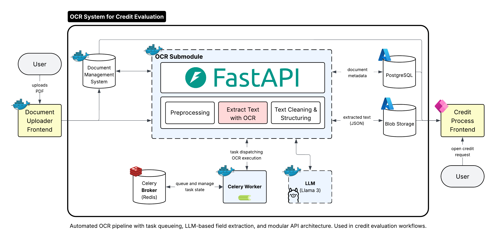

# OCR Text Extraction Tutorial

*Learn how to extract structured data from documents using spatial analysis*



---

## Prerequisites & Setup

**Before starting this tutorial, you should know:**
- Basic Python programming
- Understanding of OCR (Optical Character Recognition) concepts
- Familiarity with JSON data structures

**Required libraries:** EasyOCR, pdf2image, matplotlib, numpy

**Estimated time:** 20-20 minutes to complete the notebook

---

## The Core Problem

When you open a loan application PDF, you immediately see structured information:
- **Company Name:** DemoTech Solutions GmbH  
- **Loan Amount:** €2,000,000
- **Property Type:** Office Building

But when OCR processes the same document, it produces disconnected fragments:
```
["Company", "Name", "DemoTech", "Solutions", "GmbH", "Loan", "Amount", "€2,000,000", "Property", "Type", "Office", "Building"]
```

The machine can read individual words, but it's blind to relationships. **The challenge: How do you reconstruct human-like understanding from machine output?**

## What You'll Learn

**By the end of this tutorial, you'll be able to:**
- Extract text with bounding boxes using EasyOCR
- Group text elements by spatial proximity and alignment
- Reconstruct split text fragments into meaningful units
- Detect and pair labels with their corresponding values
- Visualize OCR results with bounding box overlays
- Handle common OCR challenges in business documents

**Key concepts covered:**
- Spatial analysis for document understanding
- Row detection and text reconstruction algorithms
- Label-value pair extraction for structured data
- Confidence scoring and quality assessment

## Core Concepts

### How Spatial Analysis Works

Humans understand documents through spatial relationships. Text appearing close together on the same horizontal line is usually related. We encode these intuitions into simple algorithms:

**Row Detection**
```python
center_y = (bbox['y1'] + bbox['y2']) / 2
if abs(center1_y - center2_y) <= 15:  # Same row if centers within 15px
    group_elements_together()
```

**Text Reconstruction**
```python
horizontal_gap = next_element['x1'] - current_element['x2']
if horizontal_gap < 20 and len(both_texts) >= 3:  # Close proximity + meaningful length
    merge_with_slash_separator()
```

**Label-Value Detection**
```python
is_potential_label = (
    text.endswith(':') or 
    '/' in text or 
    len(text) < 30
)
is_potential_value = (
    any(char in text for char in '€$£¥0123456789') or
    len(text) > len(potential_label)
)
```

These simple rules work because they mirror spatial conventions used in business documents.

---

### Learning Resources

**If you want to dive deeper into OCR and document processing, here are excellent resources:**

#### EasyOCR & OCR Fundamentals
- **[EasyOCR Documentation](https://github.com/JaidedAI/EasyOCR)** - Official repository with examples and API reference
- **[EAST: An Efficient and Accurate Scene Text Detector](https://arxiv.org/abs/1704.03155)** - The research paper behind EasyOCR's text detection
- **[Best OCR Models for Text Recognition](https://blog.roboflow.com/best-ocr-models-text-recognition/)** - Comprehensive comparison of modern OCR solutions including EasyOCR, VLMs, and cloud services

#### Document Processing & Spatial Analysis
- **[LayoutLM: Pre-training of Text and Layout for Document Image Understanding](https://arxiv.org/abs/1912.13318)** - Research paper on document structure understanding
- **[PDF Processing with Python](https://realpython.com/pdf-python/)** - Comprehensive guide to PDF manipulation

#### Advanced OCR Tools & Engineering Best Practices

When you move beyond this tutorial, you'll encounter many OCR solutions. Here's how to choose the right one for your specific use case:

**Modern OCR Solutions for Different Use Cases:**

| Tool | Best For | Key Strengths | When to Use |
|------|----------|---------------|-------------|
| **Vila** | Document QA, invoices, layout classification | Layout-aware, minimal fine-tuning | Complex document understanding tasks |
| **PICK** | Structured docs, forms, tables | End-to-end key-value extraction | Auto-filling form fields from scans |
| **OCRmyPDF** | PDF text layers, archival scans | CLI tool with deskewing, compression | Making existing PDFs searchable |
| **PaddleOCR/docTR** | Invoices, contracts, multi-layout | Fast processing, good accuracy | High-volume production systems |
| **Surya/Docling** | Academic papers, patents, tables | Multi-column detection, math support | Research and technical documents |
| **EasyOCR** *(tutorial choice)* | Multi-language microservices | Good bounding boxes, easy setup | Quick prototypes and production systems |
| **TrOCR** | Handwriting, single lines, weird fonts | Sequence-based, handles variations | Specialized text recognition tasks |

*Note: Models like Pali, ColPali/ColQwen and VQA models often provide amazing results for document understanding, but they don't provide bounding boxes and are computationally expensive. They're great for high-level document analysis but less suitable for precise spatial reconstruction.*

**Engineering Best Practices That Always Pay Off:**

The most successful OCR systems follow these proven patterns:

- **Spatial Processing**: Use IOU (Intersection over Union) merging or clustering to handle overlapping detection boxes. IOU measures how much two bounding boxes overlap - when overlap exceeds a threshold (typically 0.5-0.7), you merge them into a single detection. Most OCR engines produce redundant detections, especially when you stack multiple models for redundancy.

- **Structure Detection**: Implement simple spatial rules to group aligned boxes. Horizontal and vertical alignment often outperforms complex layout parsers for rebuilding lines, tables, and multi-column layouts.

- **Comprehensive Logging**: Log raw bounding boxes and confidence scores from day one. You'll need this data for debugging and improving your algorithms later.

- **Quality Validation**: Run a quick language model pass as a sanity check. This catches junk output early, especially important for multilingual or handwritten content.

- **Preprocessing Strategy**: Different document types need different approaches. For forms, use conservative row detection (10-15px tolerance). For tables, increase horizontal gap thresholds (25-30px). For reports, adjust label detection patterns for longer text elements.

---

### Why EasyOCR Works Well

EasyOCR provides the foundation we need for this tutorial. It combines neural network-based text detection with precise bounding boxes and confidence scores, making it ideal for spatial analysis. The engine handles multi-language support and provides robust character recognition out of the box.

What makes our approach effective is the spatial analysis layer we build on top. We add grouping of fragmented text elements, label-value pair detection for structured data extraction, and conservative algorithms that prevent over-processing while maintaining accuracy.

## System Architecture Integration

**How OCR Fits into the Credit Processing Pipeline:**

```
Document Upload → OCR Processing → Storage → LLM Analysis → Storage → API Delivery
     ↓              ↓                ↓           ↓             ↓           ↓       
   DMS           EasyOCR +        PostgreSQL    Ollama      Azurite     Frontend
                 Spatial          (Metadata)                (LLM Blobs) (Display)
                 Analysis         Azurite
                                  (OCR Blobs)
```

This tutorial focuses on the **OCR Processing** phase, where we extract structured data from documents. The extracted information flows to PostgreSQL for metadata storage and Azurite for blob storage (OCR results), gets analyzed by Ollama (LLM), and is later delivered to frontend applications for user review and correction.

## Implementation Walkthrough

The notebook guides you through four main phases of document processing:

**Phase 1: EasyOCR Text Extraction**
We start by converting PDFs to high-resolution images and extracting text with precise bounding boxes and confidence scores. This gives us the raw OCR output structure that we'll transform into meaningful data.

**Phase 2: Spatial Analysis & Reconstruction**
Using center-based alignment, we group text elements by row and reconstruct split text fragments like "VAT ID / Tax Number" that OCR often breaks apart. This phase handles common OCR artifacts and edge cases that would confuse downstream processing.

**Phase 3: Label-Value Pair Detection**
We implement pattern matching to identify potential labels and values, creating structured pairs from spatial relationships. This generates confidence scores for quality assessment and produces the final structured output.

**Phase 4: Visualization & Results**
Finally, we visualize bounding boxes on original documents, compare raw OCR versus structured output, and analyze performance metrics to validate our results.

### Expected Results

Your loan application document will transform dramatically through this process. You'll see **62 raw OCR fragments** become **43 structured elements**, with **26 label-value pairs** extracted automatically. This represents a **69% compression** while preserving all meaningful information, exactly what you need for downstream processing.

## Common Issues & Solutions

You'll encounter several typical problems when working with OCR. Here's how to handle them:

**Low OCR Confidence**
When text elements have confidence scores below 0.7, check image quality and increase DPI. Use high-resolution images (150+ DPI) for better results. If the problem persists, adjust EasyOCR parameters or add preprocessing steps.

**Split Text Elements**
OCR often breaks phrases like "VAT ID / Tax Number" into separate fragments. Adjust the horizontal gap threshold (currently 20px) in text reconstruction. Use visualization tools to see which elements are being split and tune accordingly.

**Incorrect Label-Value Pairing**
If the algorithm pairs wrong elements together, check row detection tolerance (currently 15px) and pattern matching rules. Adjust label detection patterns for your specific document type - forms need different rules than tables or reports.

**Memory Issues with Large Documents**
Processing fails on multi-page documents when memory isn't managed properly. Process pages individually or implement streaming. Clear intermediate variables between pages to prevent memory leaks.

**Configuration Tips for Different Document Types:**

| Document Type | Row Detection | Horizontal Gap | Special Considerations |
|---------------|---------------|----------------|----------------------|
| **Forms** | Conservative (10-15px) | Standard (20px) | Focus on field boundaries |
| **Tables** | Standard (15px) | Wider (25-30px) | Handle column alignment |
| **Reports** | Flexible (15-20px) | Standard (20px) | Adjust for longer text elements |

## Extending the Solution

The notebook provides a solid foundation that you can adapt for different document types and integrate into larger systems.

**Adapting for Different Document Types**

For **invoice processing**, add invoice-specific patterns like invoice numbers, total amounts, and due dates. For **contract analysis**, focus on key clauses, dates, and parties. For **medical forms**, handle checkbox patterns and medical terminology.

**Integration with LLMs**

Format your extracted data for LLM analysis by providing structured input with document type, extracted fields, confidence scores, and spatial context. Implement validation rules to ensure business logic compliance before processing.

**Database Storage**

Store results in structured format with document IDs, labels, values, confidence scores, and bounding boxes. This enables efficient querying and analysis of processed documents.

## Production Considerations

When moving from prototype to production, focus on these key areas:

- **Performance Optimization:** Enable GPU acceleration when available for faster processing. Implement confidence thresholds to filter low-quality results and use batch processing for handling multiple documents efficiently.

- **Common Production Mistakes:** Memory leaks occur when variables aren't cleared between documents, use `del` statements and garbage collection. Avoid using notebook parameters directly in production; create configuration files for different document types and A/B test parameter changes. Implement proper error handling to prevent crashes on malformed documents and log errors for analysis.

## Getting Started

**Ready to build your own document processing system?**

The notebook provides complete implementation with working code, visual debugging tools, performance metrics, and ready-to-use functions for your own documents.

**Next Steps After the Notebook:**
1. **Test with your own documents** - Try different document types and formats
2. **Tune parameters** - Adjust thresholds for your specific use case  
3. **Add validation** - Implement business rules for your domain
4. **Scale up** - Apply production considerations for larger volumes

Start with the notebook to see these concepts in action with real code and visualizations.

---

*Continue to the notebook to see these concepts in action with real code and visualizations.*
