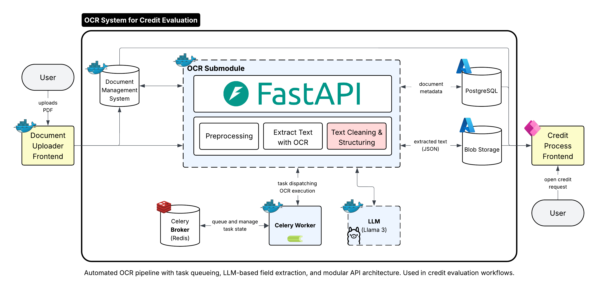

# LLM Field Extraction

*Transform OCR data into structured business intelligence using local AI models*



---

## Prerequisites & Setup

**Before starting this tutorial, you should know:**
- Basic Python programming and async/await concepts
- Understanding of LLM (Large Language Model) fundamentals
- Completion of notebooks `01_setup.ipynb` and `02_ocr_text_extraction.ipynb`

**Required services:** Ollama (running locally), PostgreSQL, Redis, Azurite
**Required libraries:** aiohttp, dataclasses, typing, json, re

**Estimated time:** 30-45 minutes to complete the notebook

---

## The Core Problem

You've successfully extracted text from documents using OCR, but now you face a new challenge:

**Raw OCR Output:**
```
Company Name: DemoTech Solutions GmbH
Legal Form: Limited Liability Company (GmbH)
Date of Incorporation: 12/05/2018
Purchase Price: €2,500,000
```

**What You Need:**
```json
{
  "company_name": "DemoTech Solutions GmbH",
  "legal_form": "GmbH", 
  "founding_date": "12.05.2018",
  "purchase_price": 2500000.0
}
```

The OCR gives you text, but you need **structured, validated, business-ready data**. How do you transform unstructured text into reliable, machine-readable information that your systems can trust?

## What You'll Learn

**By the end of this tutorial, you'll be able to:**
- Design flexible LLM client architectures for different AI providers
- Create intelligent prompts that extract structured data from documents
- Implement robust validation systems for business rules
- Build confidence-scored field extraction with metadata preservation
- Handle edge cases and errors in LLM responses
- Store and retrieve processed results from blob storage

**Key concepts covered:**
- Abstract base classes for LLM client abstraction
- Prompt engineering for structured data extraction
- Field validation against business rules
- Confidence scoring and metadata preservation
- State machine patterns for document processing

## Core Concepts

### How LLM Field Extraction Works

Unlike rule-based extraction, LLM field extraction uses natural language understanding to map document text to structured fields:

**1. Intelligent Prompting**
```python
prompt = f"""Extract the following fields from the document content below:
Field Descriptions:
- company_name: Company Name
- legal_form: Legal Form  
- purchase_price: Purchase Price / Construction Costs

Document Content:
{document_text}

Return a valid JSON object with extracted fields."""
```

**2. Structured Response Processing**
```python
llm_response = await llm_client.generate(prompt)
extracted_fields = extract_json_from_response(llm_response)
```

**3. Validation & Confidence Scoring**
```python
validation_results = validate_extracted_fields(extracted_fields, doc_config)
confidence_scores = calculate_confidence(validation_results)
```

**4. Metadata Preservation**
```python
field_data = {
    "value": "DemoTech Solutions GmbH",
    "confidence": 0.95,
    "bounding_box": [100, 200, 300, 250],
    "page": 1
}
```

This approach combines the flexibility of natural language understanding with the reliability of structured validation.

---

### Learning Resources

**If you want to dive deeper into LLM integration and field extraction, here are excellent resources:**

#### LLM Integration & Prompt Engineering
- **[OpenAI API Documentation](https://platform.openai.com/docs/api-reference)** - Comprehensive guide to LLM API integration
- **[Anthropic Claude API](https://docs.anthropic.com/claude/reference)** - Alternative LLM provider with strong reasoning capabilities
- **[Prompt Engineering Guide](https://www.promptingguide.ai/)** - Best practices for designing effective prompts
- **[Ollama Documentation](https://ollama.ai/docs)** - Local LLM deployment and management

#### Field Validation & Business Rules
- **[JSON Schema Validation](https://json-schema.org/learn/getting-started-step-by-step)** - Standard for data validation
- **[Pydantic Documentation](https://docs.pydantic.dev/)** - Python data validation using type annotations
- **[Business Rules Engine Patterns](https://martinfowler.com/bliki/RulesEngine.html)** - Architectural patterns for validation systems

#### Production LLM Systems
- **[LangChain Framework](https://python.langchain.com/docs/get_started/introduction)** - Production-ready LLM application framework
- **[LlamaIndex Documentation](https://docs.llamaindex.ai/)** - Data framework for LLM applications
- **[Semantic Kernel](https://learn.microsoft.com/en-us/semantic-kernel/overview/)** - Microsoft's AI orchestration framework

#### Advanced LLM Patterns

When you move beyond this tutorial, you'll encounter sophisticated LLM integration patterns:

**Modern LLM Integration Strategies:**

| Pattern | Best For | Key Strengths | When to Use |
|---------|----------|---------------|-------------|
| **Function Calling** | Structured data extraction | Guaranteed JSON output, type safety | When you need reliable structured responses |
| **Few-Shot Learning** | Complex reasoning tasks | Improves accuracy with examples | When tasks require specific reasoning patterns |
| **Chain-of-Thought** | Multi-step reasoning | Transparent reasoning process | When you need to understand LLM decisions |
| **RAG (Retrieval-Augmented)** | Knowledge-intensive tasks | Combines LLM with external knowledge | When you need up-to-date or domain-specific information |
| **Tool Use** | Interactive applications | LLM can use external tools/APIs | When you need LLM to perform actions |
| **Fine-tuning** | Domain-specific tasks | Optimized for specific use cases | When you have large datasets and need consistent performance |

**Engineering Best Practices for LLM Systems:**

The most successful LLM integrations follow these proven patterns:

- **Prompt Versioning**: Version your prompts like code. Use semantic versioning and track prompt changes in your CI/CD pipeline. This enables A/B testing and rollback capabilities.

- **Response Validation**: Always validate LLM responses before processing. Implement fallback strategies for malformed JSON, unexpected formats, or hallucinated content.

- **Confidence Scoring**: Don't trust LLM outputs blindly. Implement confidence scoring based on validation results, response consistency, and business rule compliance.

- **Rate Limiting & Retry Logic**: Implement exponential backoff for API calls and circuit breakers for service failures. LLM APIs can be unreliable under load.

- **Cost Management**: Track token usage and implement caching for repeated queries. Use streaming responses for long-running tasks to improve user experience.

---

### Why Local LLM Processing Matters

Our approach uses Ollama for local LLM processing, which provides several critical advantages:

**Data Sovereignty**: All sensitive financial data stays within your infrastructure
**Cost Control**: No per-request fees or usage-based pricing
**Reliability**: No dependency on external API availability
**Customization**: Full control over model selection and configuration

The Ollama client we build provides a clean abstraction that can easily be extended to support other LLM providers (OpenAI, Anthropic, etc.) without changing your core field extraction logic.

## Why Smaller Models Work for Field Extraction

**Why llama3.1:8b is Perfect for This Task:**

Field extraction and cleaning is fundamentally different from creative tasks like writing or complex reasoning. Here's why smaller models excel:

**1. Pattern Recognition vs. Creativity**
- **Field extraction** is about recognizing patterns and following rules
- **Smaller models** are excellent at pattern matching and structured output
- **No need for creativity** - we want consistent, rule-following behavior

**2. Limited Context Window**
- **Field extraction** works with small text snippets (labels and values)
- **8B models** handle this context easily without performance issues
- **No need for long-form reasoning** or extensive context

**3. Structured Output Requirements**
- **JSON generation** is a well-defined, constrained task
- **Smaller models** are more predictable for structured formats
- **Less hallucination** when tasks are clearly bounded

**4. Cost and Performance Benefits**
- **Faster inference** - 8B models respond in seconds, not minutes
- **Lower resource usage** - runs on standard hardware without GPUs
- **No API costs** - complete control over deployment and usage

**5. Validation Reduces Model Dependency**
- **Business rules** catch errors regardless of model size
- **Confidence scoring** flags uncertain extractions for review
- **Human oversight** handles edge cases that any model might miss

**The Result:** A smaller, faster, more predictable model that's perfect for the specific task of field extraction and cleaning.

## Implementation Walkthrough

The notebook guides you through five main phases of LLM field extraction:

**Phase 1: LLM Client Architecture**
We build an abstract base class for LLM clients and implement a concrete Ollama client. This design pattern enables easy switching between different LLM providers and provides a consistent interface for all AI operations.

**Phase 2: Prompt Engineering**
We create intelligent prompts that guide the LLM to extract structured data from document content. This includes field descriptions, formatting instructions, and example outputs to ensure consistent results.

**Phase 3: Field Extraction & Validation**
We implement the core extraction logic that processes LLM responses, validates fields against business rules, and preserves metadata like confidence scores and spatial information.

**Phase 4: Storage & Results**
Finally, we store processed results in blob storage and analyze performance metrics to validate our extraction accuracy and identify areas for improvement.

### Expected Results

Your OCR-processed document will transform through this process. You'll see structured OCR elements become validated business fields, with confidence scores ranging from 0.5 to 1.0. The system will automatically flag validation errors (like incorrect date formats) and provide detailed error messages for manual review.

## Common Issues & Solutions

You'll encounter several typical problems when working with LLM field extraction. Here's how to handle them:

**LLM Response Parsing Errors**
When the LLM returns malformed JSON, implement robust parsing with fallback strategies. Use regex patterns to extract JSON from markdown code blocks and handle common formatting issues.

**Field Validation Failures**
When extracted fields don't pass business rule validation, implement detailed error reporting and confidence scoring. Use pattern matching for date formats, range validation for numeric fields, and type checking for all extracted values.

**Prompt Engineering Challenges**
If the LLM consistently extracts wrong fields, refine your prompts with more specific instructions and examples. Use few-shot learning with sample inputs and expected outputs to improve accuracy.

**Performance Optimization**
Processing fails when LLM responses are too slow or unreliable. Implement timeout handling, retry logic with exponential backoff, and caching for repeated queries.

**Configuration Tips for Different Document Types:**

| Document Type | Prompt Strategy | Validation Focus | Special Considerations |
|---------------|-----------------|------------------|----------------------|
| **Credit Applications** | Field-specific descriptions | Financial data validation | Currency formatting, date consistency |
| **Invoices** | Line-item extraction | Amount calculations | Tax calculations, totals verification |
| **Contracts** | Clause identification | Legal compliance | Date validation, party identification |
| **Medical Forms** | Checkbox detection | Medical terminology | HIPAA compliance, data sensitivity |

## Extending the Solution

The notebook provides a solid foundation that you can adapt for different document types and integrate into larger systems.

**Adapting for Different LLM Providers**

To integrate with OpenAI, Anthropic, or other providers, implement new concrete classes that inherit from `LLMClient`. Each provider has different API patterns, but the abstract interface remains consistent.

**Advanced Validation Systems**

Extend the validation system with custom business rules, cross-field validation (e.g., ensuring loan amount doesn't exceed property value), and integration with external validation services.

**Real-time Processing**

Implement streaming responses for long-running extractions and real-time progress updates. Use WebSockets or Server-Sent Events to provide immediate feedback to users.

**Integration with Business Systems**

Connect extracted data to your existing business systems through APIs, database triggers, or message queues. Implement webhooks for real-time notifications when processing completes.

## Production Considerations

When moving from prototype to production, focus on these key areas:

- **Performance Optimization:** Implement connection pooling for LLM clients, use async processing for multiple documents, and implement caching for repeated extractions. Monitor token usage and response times to optimize costs and performance.

- **Common Production Mistakes:** Don't trust LLM outputs without validation - always implement business rule checking. Avoid hardcoding prompts in production code; use configuration files and version control for prompt management. Implement proper error handling and logging for debugging production issues.

- **Security & Compliance:** Ensure all sensitive data remains within your infrastructure. Implement audit logging for all extractions and maintain data lineage for compliance requirements. Use encryption for data in transit and at rest.

## Getting Started

**Ready to build your own LLM field extraction system?**

The notebook provides complete implementation with working code, comprehensive validation, confidence scoring, and ready-to-use functions for your own documents.

**Next Steps After the Notebook:**
1. **Test with your own documents** - Try different document types and formats
2. **Tune prompts** - Optimize extraction accuracy for your specific use case
3. **Add custom validation** - Implement business rules for your domain
4. **Scale up** - Apply production considerations for larger volumes

Start with the notebook to see these concepts in action with real code and comprehensive field extraction.

---

*Continue to the notebook to see these concepts in action with real code and intelligent field extraction.*

---

## Beyond Field Extraction: The Foundation for AI-Powered Document Intelligence

While we're building a field extraction system, the architecture patterns and concepts you'll learn here are the building blocks for virtually every modern AI-powered document application.

**This setup is the foundation for:**

**Intelligent Document Processing Systems**
- Our LLM client architecture → Multi-model AI systems
- Prompt engineering patterns → Natural language interfaces
- Validation frameworks → Business rule engines
- Confidence scoring → Quality assurance systems

**Enterprise AI Applications**
- Legal document analysis (contract review, compliance)
- Medical record processing (diagnosis support, research)
- Financial document analysis (risk assessment, auditing)
- Customer support automation (ticket classification, response generation)

**The concepts you'll master—LLM integration, prompt engineering, validation systems, and confidence scoring—are the same patterns powering the most sophisticated AI applications in production today.**

Whether you're building chatbots that understand company documents, research assistants that analyze scientific papers, or compliance systems that process legal contracts, you'll be using these exact architectural patterns.

**You're not just learning to extract fields from documents. You're learning to architect the intelligent systems of tomorrow.**

---

## Next Steps

Open `03_llm_field_extraction.ipynb` to start building your LLM field extraction system. The notebook will guide you step by step, explaining both the "how" and the "why" behind each action.

> **Start now:** With this setup, you have a solid base for building advanced, secure, and scalable AI-powered document processing solutions.
