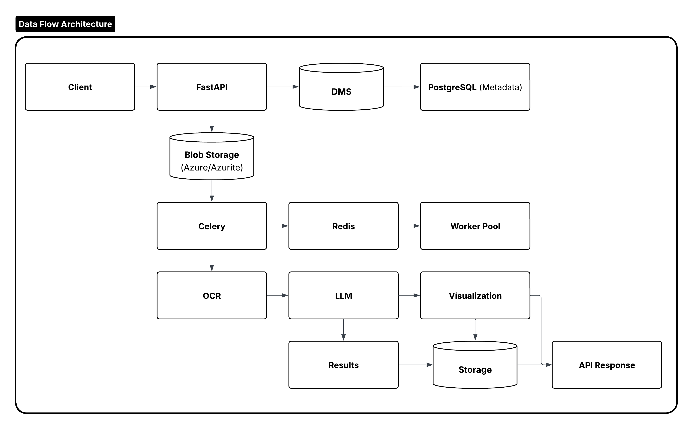

# Document Processing Status & Extraction Jobs

*Operational visibility for your document pipeline: readiness, progress, and jobs*

## Data Flow Architecture

Here's how document status and processing data flows through the system:



This architecture shows the relationship between document storage, status tracking, and the various services that update and query processing states.

---

## Prerequisites & Setup

**Before starting this tutorial, you should know:**
- Basic Python programming and data structures
- How notebooks 01–05 work (setup, OCR, LLM, DMS upload)

**Required services:** PostgreSQL, Azurite (from compose.yml)
**Estimated time:** 15–25 minutes

---

## The Core Problem

Uploading a document is just the beginning. Stakeholders need to know:
- Is the document ready to process?
- Which stage is currently running?
- What jobs were created, when did they finish, and did any fail?

A robust status model answers these questions with minimal coupling and maximum clarity.

---

## What You'll Learn

By the end, you'll understand how to:
- Model document readiness with a conservative “text extraction status”
- Track pipeline progress with a simple “processing status”
- Record discrete work units with extraction jobs (timestamps + errors)
- Integrate status updates into the OCR→LLM pipeline

---

## Core Concepts

### Document Status Flow

The system tracks document processing through multiple status dimensions:

**Processing Status Flow:**
```
pending extraction → ocr running → llm running → done
        ↓                ↓            ↓        ↓
      failed ←        failed ←    failed ←  failed
```

**Text Extraction Status Flow:**
```
not ready → ready → in progress → completed
    ↓         ↓         ↓            ↓
  failed ←  failed ←  failed ←    failed
```

### 1) Two Status Models + Jobs (Why two?)

- **Text Extraction Status (on `documents`)**
  - Focus: document readiness and extraction outcome
  - Values: `not ready`, `ready`, `in progress`, `completed`, `failed`
  - Ownership: DMS and validators

- **Processing Status (on `documents`)**
  - Focus: pipeline stage visibility
  - Values: `pending extraction`, `ocr running`, `llm running`, `done`
  - Ownership: pipeline components

- **Extraction Jobs (in `extraction_jobs`)**
  - Focus: track discrete runs with timestamps and errors
  - Values: `pending extraction`, `done`, `failed`

This separation lets you reason about “can/should we process” vs “where are we now” without mixing concerns.

### 2) Benefits
- Clear SLAs per status dimension (readiness vs execution)
- Simpler observability and alerting
- Easier retries and idempotency
- Minimal coupling between DMS and processing pipeline
- **Easy debugging**: Quickly identify where issues occur in the pipeline

### 3) Tradeoffs
- Two statuses require coordination in code
- You must document when each status is updated (this README + notebook does that)

### 4) Best Practices
- Default to conservative: start at `not ready`, promote to `ready` only after validations (blob retrievable, MIME allowed)
- Keep `processing_status` writes inside pipeline components
- Always set `completed_at` for `done`/`failed` jobs
- Avoid adding many states—prefer few, well-defined states

---

## How It’s Implemented

- Database (`database/schemas/schema.sql`)
  - `documents.text_extraction_status` with CHECK constraint
  - `documents.processing_status` with CHECK constraint
  - `extraction_jobs` table for per-run tracking

- DMS Service (`src/dms/service.py`)
  - On upload: inserts doc as `not ready`, validates blob + MIME → set `ready` and create job
  - Helpers: `mark_ocr_running`, `mark_llm_running`, `mark_processing_done`

- Pipeline (`src/integration/pipeline.py`)
  - Sets `ocr running` at OCR start
  - Sets `llm running` at LLM start
  - Sets `done` after LLM finishes

---

## Production Considerations

- **Scaling**: The model is trivially sharded by `document_id`; add indexes if throughput grows
- **Idempotency**: Use stable job keys or guard against duplicate job inserts when retried
- **Observability**: Emit structured logs/metrics whenever a status changes
- **Error Handling**: Store `error_message` and set `completed_at` on terminal states
- **Access Patterns**: Add composite indexes (e.g., `(document_id, created_at DESC)`) for job lookups

---

## Common Issues & Solutions

- "Doc stays not ready": Check MIME allowlist and blob retrievability from storage
- "Jobs missing completed_at": Ensure terminal states set it (`done`/`failed`)
- "No status updates visible": Verify pipeline integration points are executed

## Debugging with Status Models

The two status models provide powerful debugging capabilities:

**Text Extraction Status** helps identify:
- Upload validation failures (stuck at "not ready")
- Processing failures (stuck at "in progress" or marked "failed")
- Success confirmation (reached "completed")

**Processing Status** pinpoints exactly where issues occur:
- "pending extraction" → Document uploaded but pipeline not started
- "ocr running" → OCR step is active (check OCR service health)
- "llm running" → LLM step is active (check LLM service health)
- "done" → Pipeline completed successfully

**Extraction Jobs** provide detailed failure context:
- Error messages in `error_message` field
- Timestamps showing when failures occurred
- Multiple job attempts for retry scenarios

**Example debugging scenarios:**
- Document stuck at "ocr running" → OCR service is down or overloaded
- Document shows "failed" with job error "Unable to extract text" → OCR processing failed
- Document at "llm running" for hours → LLM service timeout or model loading issue
- Multiple failed jobs with same error → Systematic issue requiring investigation

---

## Getting Started

Open `06_document_processing_status.ipynb` and run cells top-to-bottom. You will:
- Upload a test document
- Observe initial statuses and job creation
- Simulate OCR→LLM transitions and finalization
- Inspect failure recording

> The notebook demonstrates usage; this README explains the design rationale, benefits, tradeoffs, and best practices.
