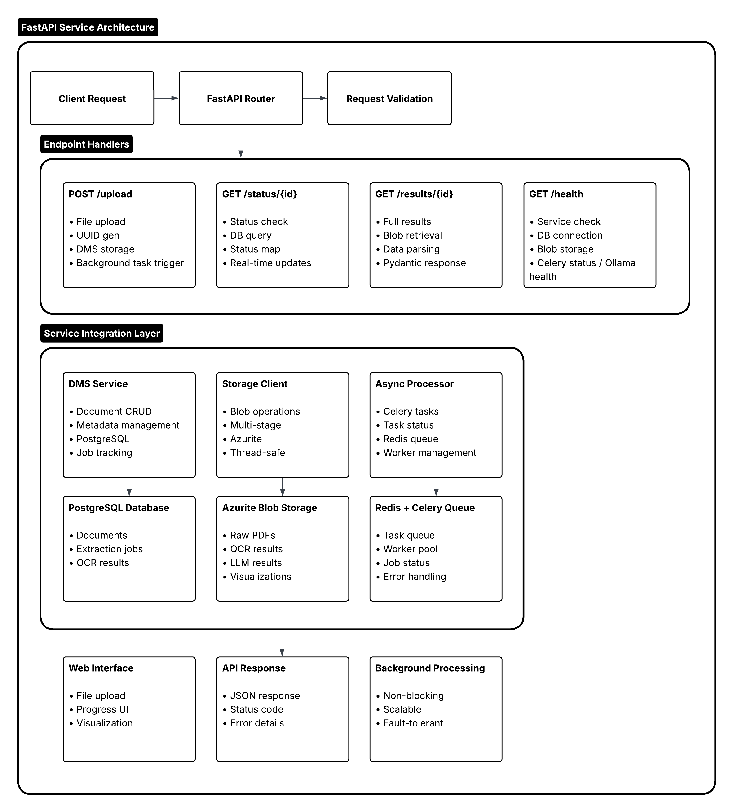

# REST API Service for Document Processing

*Building a production-ready FastAPI service to expose our credit OCR system via HTTP endpoints*

## FastAPI Service Architecture

Here's how the FastAPI service integrates with the async processing pipeline:



This architecture demonstrates the complete flow from API requests through background processing to result delivery.

---

## What You'll Learn

This notebook demonstrates how to:
- Start a FastAPI service that exposes our complete OCR pipeline
- Handle file uploads via REST endpoints
- Track document processing status in real-time
- Serve visualizations with OCR bounding boxes
- Integrate with the complete processing infrastructure

---

## Core Problem

**Isolated Processing Limitations:**
- Jupyter notebooks are great for development but not production
- No standardized interface for external systems to consume our OCR pipeline
- Manual file handling doesn't scale for business applications
- No way for frontend applications to integrate with our processing
- Difficult to monitor and manage processing requests at scale

**Production API Requirements:**
- RESTful HTTP interface for easy integration
- Asynchronous processing with status tracking
- File upload handling with validation
- Error handling and proper HTTP status codes
- Documentation and testing capabilities

---

## Solution Architecture

### FastAPI Service Design

Our API service provides these core capabilities:

**1. Document Upload & Processing**
```
POST /api/v1/upload
- Accepts PDF files via multipart form data
- Validates file type and content
- Triggers async processing pipeline
- Returns document ID for tracking
```

**2. Status Tracking**
```
GET /api/v1/status/{document_id}
- Real-time processing status
- Error reporting if processing fails
- Timestamp tracking for SLA monitoring
```

**3. Results Retrieval**
```
GET /api/v1/results/{document_id}
- Complete extraction results
- Structured field data with confidence scores
- OCR elements with bounding boxes
```

**4. Visualization Access**
```
GET /api/v1/visualization/{document_id}
- OCR overlay images
- Confidence color coding
- Page-by-page visualization
```

### Technology Choices & Trade-offs

**FastAPI over Django/Flask:**
- ✅ **Automatic API documentation** (Swagger/OpenAPI)
- ✅ **Type safety** with Pydantic models
- ✅ **High performance** (async/await support)
- ✅ **Modern Python features** (type hints, async)
- ❌ Less mature ecosystem than Django
- ❌ Fewer third-party integrations

**Asynchronous Processing:**
- ✅ **Non-blocking uploads** - immediate response to clients
- ✅ **Horizontal scaling** - multiple workers can process documents
- ✅ **Better resource utilization** - CPU-intensive tasks don't block API
- ❌ **Complexity** - requires message queue (Redis) and worker management
- ❌ **Eventual consistency** - results aren't immediately available

**RESTful Design:**
- ✅ **Standard HTTP methods** - familiar to any developer
- ✅ **Stateless** - easy to scale horizontally
- ✅ **Cacheable** - standard HTTP caching can be applied
- ✅ **Language agnostic** - any client can consume the API
- ❌ **Multiple round trips** - status checking requires polling

### Infrastructure Integration

**Database Layer:**
- PostgreSQL for document metadata and status tracking
- Standardized schema for multi-tenant support
- Connection pooling for high concurrency

**Storage Layer:**
- Azure Blob Storage (Azurite for development)
- Staged processing (raw → ocr → llm → annotated)
- Efficient binary data handling

**Processing Layer:**
- Celery workers for async document processing
- Redis message broker for task queuing
- Error handling and retry logic

**API Layer:**
- FastAPI with automatic OpenAPI documentation
- Pydantic models for request/response validation
- CORS support for frontend integration

---

## Design Decisions Deep Dive

### 1. Why FastAPI?

**Performance Requirements:**
Financial document processing demands high throughput. FastAPI's async capabilities allow us to handle hundreds of concurrent upload requests while OCR/LLM processing happens in the background.

**Developer Experience:**
Automatic API documentation reduces integration friction for frontend teams. Type safety catches errors early and improves code maintainability.

**Production Readiness:**
Built-in support for dependency injection, middleware, and testing makes FastAPI suitable for enterprise deployment.

### 2. Async vs Sync Processing

**Synchronous Approach:**
```python
# Client waits 2-5 minutes for processing
POST /process-document
→ Upload → OCR → LLM → Response (2-5 min later)
```

**Asynchronous Approach:**
```python
# Client gets immediate response
POST /upload → Immediate response with document_id
GET /status/{id} → Check processing status
GET /results/{id} → Retrieve completed results
```

We chose async because:
- **User Experience:** No timeouts on long-running processes
- **Scalability:** Can queue thousands of documents for processing
- **Resource Efficiency:** API servers aren't blocked by CPU-intensive tasks

### 3. API Versioning Strategy

All endpoints include `/v1/` to support future API evolution:
- `/api/v1/upload` - Current version
- `/api/v2/upload` - Future enhanced version (parallel deployment)

This allows backward compatibility while introducing new features.

### 4. Error Handling Philosophy

**HTTP Status Codes:**
- `200` - Success
- `202` - Accepted (async processing started)
- `400` - Client error (invalid file, parameters)
- `404` - Resource not found
- `500` - Server error

**Error Response Format:**
```json
{
  "error": "ValidationError",
  "message": "Only PDF files are allowed",
  "detail": "File type: text/plain"
}
```

Consistent error format helps client applications handle failures gracefully.

### 5. Security Considerations

**File Upload Security:**
- File type validation (PDF only)
- File size limits (configurable)
- Content-type verification
- Virus scanning integration points

**Authentication & Authorization:**
- JWT token support (configurable)
- API key authentication for machine-to-machine
- Rate limiting to prevent abuse

**Data Privacy:**
- Document isolation by tenant
- Configurable data retention policies
- Audit logging for compliance

---

## Production Deployment Considerations

### Scaling Strategy

**Horizontal Scaling:**
```
Load Balancer
├── FastAPI Instance 1
├── FastAPI Instance 2
└── FastAPI Instance 3

Background Processing:
├── Celery Worker 1 (OCR focused)
├── Celery Worker 2 (LLM focused)
└── Celery Worker 3 (General purpose)
```

**Vertical Scaling:**
- OCR workers: CPU optimized (high core count)
- LLM workers: GPU optimized (NVIDIA T4/A100)
- API instances: Memory optimized (high concurrency)

### Monitoring & Observability

**Health Checks:**
- `/api/v1/health` endpoint for load balancer
- Database connectivity checks
- Storage service validation
- Worker queue health monitoring

**Metrics & Logging:**
- Processing time per document type
- Success/failure rates by endpoint
- Queue depth monitoring
- Resource utilization tracking

### Integration Patterns

**Frontend Integration:**
```javascript
// Upload document
const formData = new FormData();
formData.append('file', pdfFile);
const upload = await fetch('/api/v1/upload', {
  method: 'POST',
  body: formData
});
const {document_id} = await upload.json();

// Poll for results
const pollResults = async () => {
  const status = await fetch(`/api/v1/status/${document_id}`);
  const {status: processingStatus} = await status.json();
  
  if (processingStatus === 'completed') {
    const results = await fetch(`/api/v1/results/${document_id}`);
    return results.json();
  } else if (processingStatus === 'failed') {
    throw new Error('Processing failed');
  }
  
  // Continue polling
  setTimeout(pollResults, 2000);
};
```

**Backend Integration:**
```python
# Webhook notifications (future enhancement)
@app.post("/webhook/document-processed")
async def document_processed(webhook_data: WebhookData):
    # Notify downstream systems when processing completes
    await notify_loan_system(webhook_data.document_id)
```

---

## Business Value

### For Development Teams
- **Faster integration:** Standard REST API vs custom protocols
- **Better testing:** Automated API testing vs manual notebook execution
- **Easier deployment:** Standard web service vs notebook server management

### For Business Users
- **Web interface:** Upload documents via browser instead of technical tools
- **Real-time tracking:** See processing progress instead of waiting blindly
- **Error visibility:** Clear feedback when processing fails

### For Operations Teams
- **Monitoring:** Standard web service metrics and health checks
- **Scaling:** Horizontal scaling based on demand
- **Maintenance:** Rolling deployments without service interruption

---

## Next Steps

After completing this notebook, you'll have:
1. A running FastAPI service exposing the complete OCR pipeline
2. Web interface for testing document uploads
3. Understanding of API design patterns for document processing
4. Foundation for building production applications

**Future Enhancements:**
- Authentication and authorization
- Webhook notifications for completed processing
- Batch processing endpoints
- Performance optimization and caching
- Multi-tenant document isolation
