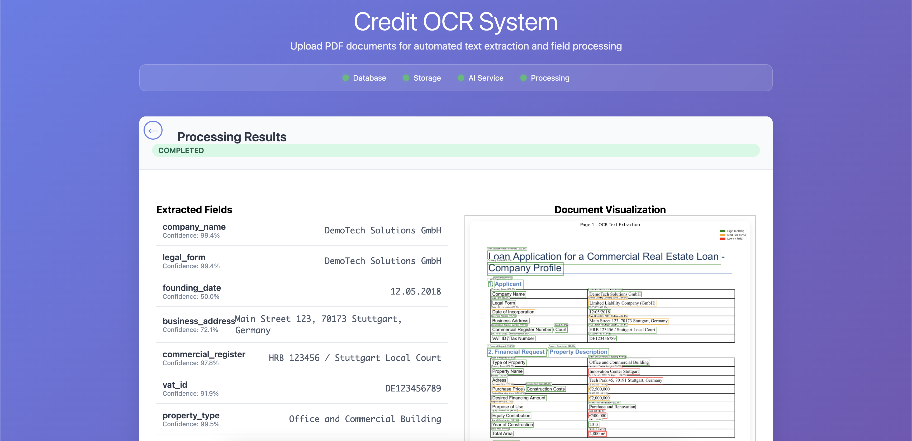

# Credit OCR System - Application Setup Guide

## Application Showcase

Here's what you'll be building - a complete document processing web application:



**Key Features Shown:**
- **Clean Upload Interface**: Upload PDF documents
- **Real-time Progress Tracking**: Visual progress indicators for OCR and AI processing stages
- **Service Status Monitoring**: Live status dots for all system components (Database, Storage, AI Service, Processing)
- **Extracted Field Results**: Structured data extraction from documents
- **OCR Visualization**: Interactive overlay showing detected text regions with confidence scores
- **Professional UI/UX**: Modern, responsive design suitable for business environments

## One-Command Startup

The easiest way to start the complete Credit OCR System:

```bash
python3 start_credit_ocr.py
```

This script will automatically:
- Check prerequisites (Docker, Python 3.9+)
- Start all infrastructure services (PostgreSQL, Redis, Azurite, Ollama)
- Download the AI model (llama3.1:8b) if not present
- Start Celery workers for background processing
- Launch the FastAPI web service
- Wait for all services to be ready

## What You'll See

```
Starting Credit OCR System...
Docker is available
Python 3.11 is available
Starting infrastructure services...
Found existing containers, reusing them...
Infrastructure services started
Waiting for services to be ready...
Core services are ready
Checking Ollama model availability...
Model already exists in volume, loading...
Ollama model (llama3.1:8b) is ready
Starting Celery worker...
Celery worker started
Starting Credit OCR API...
Credit OCR API is running
Credit OCR System is fully ready!
Web interface: http://127.0.0.1:8000/
API docs: http://127.0.0.1:8000/docs
Press Ctrl+C to stop the system
```

## Access Points

Once started, you can access:

- **Web Interface**: http://127.0.0.1:8000/
  - Upload PDFs and see real-time processing
  - View service status indicators
  - See extracted fields and visualizations

- **API Documentation**: http://127.0.0.1:8000/docs
  - Interactive API documentation
  - Test endpoints directly

- **Health Check**: http://127.0.0.1:8000/api/v1/health
  - Monitor service status

## First Run Notice

First run will take longer (5-10 minutes) because:
- Docker images need to be downloaded
- The AI model (llama3.1:8b, ~4.7GB) needs to be downloaded
- Database schemas need to be created

Subsequent runs are much faster (~30 seconds) because:
- Existing containers and volumes are reused
- AI model is already cached and doesn't need re-downloading
- Database data persists between restarts

## Manual Alternative

If you prefer manual control, you can still use individual components:

```bash
# 1. Start infrastructure
docker compose up -d

# 2. Start Celery worker (in separate terminal)
python -m celery -A src.celery_app worker --loglevel=info

# 3. Start API (in separate terminal)
python run_api.py
```

## Prerequisites

- **Docker**: For infrastructure services
- **Python 3.9+**: For the application
- **8GB+ RAM**: Recommended for the AI model
- **10GB+ free disk**: For Docker images and AI model

## Troubleshooting

- **Port conflicts**: Ensure ports 5432, 6379, 8000, 10000, 11435 are available
- **Model download slow**: First download depends on internet speed
- **Services not ready**: Wait a bit longer, especially on slower machines
- **Permission issues**: Ensure Docker daemon is running and accessible

## Stopping the System

Press `Ctrl+C` in the terminal running the startup script. This will:
- Stop the API server
- Stop Celery workers  
- Leave Docker services running (for faster restart)

To fully stop everything including Docker services:
```bash
docker compose down
```

## Architecture Overview

The system consists of:

- **FastAPI Web Application** - Main interface and API
- **PostgreSQL Database** - Document metadata storage
- **Redis** - Task queue and caching
- **Azurite** - Azure Blob Storage emulator for file storage
- **Ollama + llama3.1:8b** - AI model for text extraction
- **Celery Workers** - Background document processing
- **EasyOCR** - Text recognition from PDFs

## Development Workflow

1. **Start system**: `python3 start_credit_ocr.py`
2. **Upload documents** via web interface
3. **Monitor processing** with real-time status updates
4. **View results** with extracted fields and visualizations
5. **Stop system**: `Ctrl+C`

For notebook-based exploration, see the other folders in the `notebooks/` directory for step-by-step tutorials.